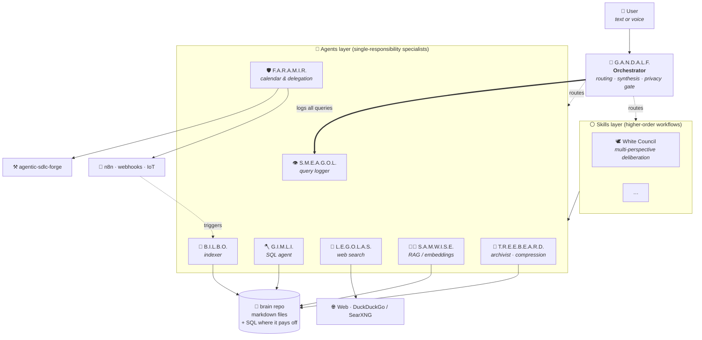

# 🧙 G.A.N.D.A.L.F.

**G**enerative **A**gent **N**avigating **D**atabases **A**nd **L**ocal **F**iles

> A local-first, multi-agent personal AI assistant running on Raspberry Pi 5.
> An attempt at building my own J.A.R.V.I.S. — minus the billionaire and the Iron Man suit.

---

## ⚠️ Project status

**This is a concept document.** Nothing is implemented yet. Every element described below — architecture, agents, knowledge base structure, technology choices — is subject to change as the project evolves. The README captures the *direction*, not the specification. Pieces will be built incrementally, and the design will adapt to what real usage reveals.

---

## 💡 Motivation

This project exists for four reasons, in roughly this order:

1. **Learn.** Modern multi-agent systems, RAG, agentic workflows, and on-device LLMs are reshaping how software is built. The best way to understand them is to build one from scratch.
2. **Build my own J.A.R.V.I.S.** The Tony Stark assistant fantasy is unattainable in full, but a stripped-down personal version — one that knows my projects, my data, and my context — is achievable today on consumer hardware.
3. **Own the stack.** Most useful AI tooling sends private data to third-party APIs. A local-first system keeps personal context (notes, finances, relationships, health) on hardware I control.
4. **Use the hardware I already have.** A Raspberry Pi 5 and a desktop with an RTX 2070 Super are sitting in my homelab. They're capable of running this — they just need the right software.

---

## 🏷️ A note on naming

All components in this system follow a `X.Y.Z.` acronym format, and yes — the names are Tolkien references. This is a deliberate convention, not an accident:

- The acronym always describes the component's **role** (e.g. `G.A.N.D.A.L.F.` = *Generative Agent Navigating Databases And Local Files*).
- The character chosen reflects the component's **disposition** — Samwise carries weight, Gimli digs through structured data, Legolas scouts the outside world, Treebeard remembers everything from long ago.
- The metaphor fits the hardware: a small Raspberry Pi shouldering a large workload, a fellowship of specialised agents instead of one all-knowing model.
- **Skills** follow a different convention — they take their names from Tolkien **events or groups** (the *White Council*, the *Last Alliance*) rather than single characters, because a skill is plural by nature.

If a name feels forced, the role probably needs rethinking.

---

## 🏛️ Architecture

G.A.N.D.A.L.F. is built as a **router + specialised sub-agents** pattern, with an optional **skills layer** for higher-order workflows that orchestrate multiple agents. The main orchestrator does not try to know everything — it classifies incoming requests, routes them to a single agent or a skill, and synthesises the final answer.

The architecture is intentionally open to **multiple orchestrators** in the future. Gandalf is the first one — a generalist router for personal queries — but specialised orchestrators (for example, a dev-focused or a homelab-focused one) can co-exist and federate. For now there is one Gandalf and the rest is intentional headroom.



### Engine layer

Underneath the agents sits an **engine** — the actual LLM doing the work. The MVP commits to a single choice for speed of iteration, with a planned abstraction layer once the system stabilises:

| Phase | Engine | Rationale |
|---|---|---|
| MVP | Claude Code / Claude API | Fast to build on, mature tool-calling, skills + sub-agents already work the way this project wants them to |
| Phase 2 | Abstraction layer + local models (Ollama) | Model-agnostic interface so any agent can run on a local model, the cloud, or both depending on cost/privacy/latency |

The local-first goal from the motivation is not abandoned — it's deferred. Getting the **shape** right first (skills, agents, knowledge base, routing) matters more than getting the engine right; engines are interchangeable, architecture is not.

---

## 🧝 The Fellowship — agents and skills

The fellowship splits into two layers:

- **Agents** are single-responsibility specialists. Each owns one narrow job and is named after a Tolkien character with the matching disposition, with the role encoded as an acronym (e.g. G.I.M.L.I. — *Generative Intelligence Mining Local Information*). Small local models perform well on narrow tasks and poorly on generic "do everything" prompts, which is why this layer exists at all.
- **Skills** are higher-order workflows that orchestrate multiple agents to deliver something none of them can deliver alone. Skills follow the event-or-group naming convention described above.

### Roles — current and proposed

The table below maps roles to the fellowship: what already exists, what could be added, and the proposed Tolkien naming. None of the *proposed* names are commitments — they're sketches showing the convention extends cleanly past the MVP.

| Role | Type | Status | Tolkien proposal | Acronym / rationale |
|---|---|---|---|---|
| Orchestrator (router + synthesis) | — | exists | **G.A.N.D.A.L.F.** | *Generative Agent Navigating Databases And Local Files* |
| Semantic search over notes | Agent | exists | **S.A.M.W.I.S.E.** | *SQL And Markdown Wading Into Semantic Embeddings* |
| Structured-data querying | Agent | exists | **G.I.M.L.I.** | *Generative Intelligence Mining Local Information* |
| Web search / outside world | Agent | exists | **L.E.G.O.L.A.S.** | *Local Engine Generating Outputs, Looking At Search* |
| Background indexer | Agent | exists | **B.I.L.B.O.** | *Bot Indexing Local Binary Objects* |
| Calendar / delegation / actions | Agent | exists | **F.A.R.A.M.I.R.** | *Forwarding Actions, Reminders And Meetings, Invoking Repositories* |
| Query logging | Agent | exists | **S.M.E.A.G.O.L.** | *Storage Module Evaluating All Gandalf's Operational Logs* |
| Archival / compression / historical retrieval | Agent | exists | **T.R.E.E.B.E.A.R.D.** | *Temporal Repository Engine Evaluating, Archiving And Reducing Data* |
| Personal advisor (single voice) | Agent | proposed | **G.A.L.A.D.R.I.E.L.** | *Guidance Agent for Life Alignment: Decisions, Reflection, Insight, Evaluation, Lookahead* |
| Content drafting (posts, articles, copy) | Agent | proposed | **L.I.N.D.I.R.** | *Language and Ideation Node for Drafting, Illustrating, Rewriting*. Minstrel of Rivendell — composes words for an audience. |
| Outreach / external lead research | Agent | proposed | **H.A.L.D.I.R.** | *Handling Active Lead Discovery, Intelligence, Research*. Lothlórien border-warden — works at the edge of known territory. |
| Multi-perspective deliberation | Skill | proposed | **White Council** | Orchestrates several advisor-agents (e.g. Galadriel + others) to surface multiple angles on a hard decision. Skill name follows the event-or-group convention. |
| Multi-channel gateway / dispatcher | Agent | proposed | **R.A.D.A.G.A.S.T.** | *Relaying Agent Dispatching And Gathering Across System Transports* — Radagast the Brown, friend to birds and beasts, carries messages across wild lands; disposition = multi-channel reach. |
| Log analysis & insight extraction | Agent or Skill | TBD | — | Reads Smeagol's logs to surface patterns, gaps, retro material. Persona deliberately not assigned yet. |
| Development task execution | external | exists | [`agentic-sdlc-forge`](https://github.com/Jarkendar/agentic-sdlc-forge) via F.A.R.A.M.I.R. | Not part of the fellowship — an external executor invoked through Faramir. |

The eight existing agents are described below. The proposed roles are placeholders to be revisited once Smeagol's logs reveal which gaps actually matter.

### 🧑‍🌾 S.A.M.W.I.S.E.

**S**QL **A**nd **M**arkdown **W**ading **I**nto **S**emantic **E**mbeddings

The semantic search specialist. Handles unstructured data: notes, PDFs, transcripts, articles. Generates embeddings via a local model (e.g. `nomic-embed-text` through Ollama) and queries a vector database. Sam is the agent that knows *where to look* in private documents.

### 🪓 G.I.M.L.I.

**G**enerative **I**ntelligence **M**ining **L**ocal **I**nformation

The SQL agent. Digs through structured data: finance exports, dev-tracker logs, media metadata, homelab telemetry. Operates on SQLite databases with schema-aware prompts. When a question involves counting, summing, filtering, or comparing — Gimli takes over.

### 🏹 L.E.G.O.L.A.S.

**L**ocal **E**ngine **G**enerating **O**utputs, **L**ooking **A**t **S**earch

The scout. The only agent with outbound network access. Performs web searches for fact verification, current prices, exchange rates, news, and anything time-sensitive that can't live in the local knowledge base. Starts with DuckDuckGo, with a self-hosted SearXNG instance as the long-term target.

### 🎒 B.I.L.B.O.

**B**ot **I**ndexing **L**ocal **B**inary **O**bjects

The indexer. Not a reactive agent — runs in the background as a scheduled task. Walks watched directories, detects new or modified files, chunks them, and stores them in the knowledge base. Bilbo is what keeps the knowledge base alive without manual upkeep.

### 🛡️ F.A.R.A.M.I.R.

**F**orwarding **A**ctions, **R**eminders **A**nd **M**eetings, **I**nvoking **R**epositories

The executor and delegator. Manages calendars, reminders, and — most importantly — delegates real work to external systems. Faramir is the bridge between G.A.N.D.A.L.F. (knowledge orchestration) and tools like [`agentic-sdlc-forge`](https://github.com/Jarkendar/agentic-sdlc-forge) (development orchestration) or `n8n` workflows. When a request requires *doing something* rather than *knowing something*, Faramir handles the handoff.

### 👁️ S.M.E.A.G.O.L.

**S**torage **M**odule **E**valuating **A**ll **G**andalf's **O**perational **L**ogs

Smeagol's job ends at *writing the log*. He doesn't analyse it. The system improves by reading its own logs, but the *reader* is intentionally a separate role (see the role table — a future log-analysis agent or skill, persona TBD). Keeping logging and analysis separate makes both replaceable.

### 🌳 T.R.E.E.B.E.A.R.D.

**T**emporal **R**epository **E**ngine **E**valuating, **A**rchiving **A**nd **R**educing **D**ata

The archivist. Old, slow, speaks at length, and remembers everything. Treebeard runs on a schedule (nightly or weekly) and performs three jobs that no other agent owns:

1. **Compression.** Groups of stale chunks within the same silo are summarised by a local LLM into a single condensed chunk — fifty daily notes from March collapse into one *"March 2026: worked on X, read Y, opinions on Z shifted from A to B"* chunk. Originals move to `brain/archive/`; the summary stays in the source folder (Phase 2+: in the active vector collection).
2. **Supersession resolution.** When a fact is updated (`superseded_by` pointer set), Treebeard decides whether the old version should remain individually retrievable (e.g. core profile or relationship history) or be folded into a periodic snapshot.
3. **Archive retrieval.** When Gandalf receives an explicitly historical query (*"what did I think about X two years ago?"*, *"how were my finances in 2024?"*), Treebeard is called instead of Samwise — he is the one with access to `brain/archive/`.

Treebeard is why the active knowledge base stops growing linearly after roughly two years of use. Without him, the system slowly drowns in its own past.

---

## 🧠 Knowledge base

The knowledge base is the hardest part of the project. Not because storing data is difficult — but because *organising personal context so that an AI can use it well* is an open problem. The design here is deliberately staged: start small, evolve as real usage reveals what's needed.

### Design principles

- **Privacy is tiered, not binary.** Some data should never leave the device under any circumstances. Other data can be sent to cloud models when needed. The split is enforced architecturally, not by convention.
- **Rate of change determines storage strategy.** Stable facts ("I live in Poland") and rapidly changing context ("what I read today") cannot share the same indexing logic.
- **Structure matters.** Bank exports belong in SQL, not in a vector database. Forcing everything into embeddings degrades both retrieval quality and answer correctness.
- **Not everything deserves embeddings.** Full PDFs, course HTML, and reference books are expensive to vectorise and produce noisy retrieval. They belong in cold storage with a thin searchable manifest pointing to them.
- **Evolutionary schema.** The initial structure will be wrong in unexpected ways. The system must be easy to refactor as real usage reveals what's missing.
- **Append-only with compression.** History has value, but unbounded growth does not. Old data is preserved as compressed summaries, not deleted.

### Phase 1 — A markdown brain in a git repo

The MVP knowledge base is a **separate `brain/` repository, mostly markdown files, version-controlled in git**. No vector database, no embeddings — at MVP scale they cost more than they pay back, and a flat tree of MD files is debuggable in a way Chroma never is.

```
brain/
├── core/
│   ├── profile.md          # who I am, stable facts
│   ├── goals.md            # current goals & horizons
│   ├── projects.md         # active projects, status
│   └── contacts.md         # people, relationships, context
├── knowledge/              # topics, learning, references
├── current/                # daily notes, recent activity
├── conversations/          # exported AI conversations
└── archive/                # Treebeard's compressed summaries (Phase 2+)
```

Two top-level rules:

1. **Markdown by default.** If the data is text-shaped — notes, summaries, transcripts, profile info, project context — it goes into a `.md` file. Gandalf reads the files directly; no embedding layer needed at this scale.
2. **SQL only when the shape demands it.** Structured, high-volume, schema-stable data — bank transactions, dev-tracker telemetry, media consumption logs — goes into SQLite. The rule is simple: if you'd answer the question with `GROUP BY`, it belongs in SQL.

This collapses the earlier *public / private* zone split into something simpler: **privacy is a folder-level concern**, enforced by which folders local-only models are allowed to read. `core/` and `current/` are private; `knowledge/` is public.

### Phase 2 — Vectors, when they earn their keep

Once the brain repo passes a few thousand markdown files and direct retrieval starts feeling slow or noisy, S.A.M.W.I.S.E. adds an embedding layer **over** the existing files. The markdown stays canonical; the vector DB is just an index pointing back at it. Each top-level folder in `brain/` becomes a vector collection of the same name prefixed with `kb_` (so `brain/current/` indexes into `kb_current`, `brain/knowledge/` into `kb_knowledge`, etc.) — this is the naming used in the *Memory hierarchy* section below. B.I.L.B.O.'s scheduled-indexer role is deferred until this phase — at MVP scale, files change rarely enough that re-reading on demand is fine.

### Phase 3 — Domain silos & hybrid structures (when justified)

Once S.M.E.A.G.O.L.'s logs show which folders are actually queried, used, and useful, dedicated silos can be carved out — and more sophisticated structures can be added selectively:

- **Knowledge graph** layer for explicitly curated areas (projects, learning paths)
- **Time-aware retrieval** with recency boosting for fast-changing folders
- **Hierarchical retrieval** (search summaries first, fetch full content on demand)

Splits are driven by logged usage, not upfront design.

### Ingestion pipelines

Data has to get *into* the brain repo somehow, and almost none of it starts there. The pattern is the same in every case: an **external trigger** → an **n8n flow** → a **markdown file committed to `brain/`**. n8n is the glue; the brain repo is the destination. Concrete examples:

| Source | Pipeline | Lands in |
|---|---|---|
| **Voice notes** (phone, walking, dictation app) | recording → cloud sync → n8n watcher → Whisper STT → LLM summary → MD | `brain/current/voice/YYYY-MM-DD.md` |
| **Email** (newsletters, receipts, threads worth keeping) | forwarded to a dedicated address → n8n IMAP poll → strip + summarise → MD | `brain/knowledge/email/<topic>.md` or `brain/current/email/` |
| **Drive files** (PDFs, exports, scans) | new file in watched Drive folder → n8n download → text extraction → MD + cold file kept on disk | `brain/knowledge/<topic>/` + `brain/_blobs/` |
| **GitHub activity** (commits, PRs, issues from my repos) | webhook → n8n → grouped daily digest → MD | `brain/current/dev/YYYY-MM-DD.md` |
| **Quick capture** (links, thoughts, snippets from anywhere) | Telegram/Signal bot → n8n → MD with tags from the message | `brain/current/captures/YYYY-MM-DD.md` |
| **Calendar events** (meetings, decisions, attendees) | calendar webhook → n8n → templated MD (attendees, notes placeholder) | `brain/current/meetings/YYYY-MM-DD-<slug>.md` |
| **Watched folders** (Obsidian, Downloads) | direct filesystem sync — bypasses n8n | `brain/knowledge/` or `brain/current/` |
| **Manual** (paste, drop into folder, commit) | human writes/pastes MD | anywhere |

A few principles hold across all of them:

- **One source → one folder.** No fan-out. Voice notes don't end up scattered across three places; one folder per pipeline, easy to audit, easy to delete.
- **Raw + summary, never just summary.** When LLMs are involved (transcription, extraction), the original artifact is kept in `_blobs/` so summaries can be regenerated later.
- **Date-prefixed filenames.** `YYYY-MM-DD-<slug>.md` makes Treebeard's compression and retro queries trivial.
- **Idempotency.** Every n8n flow must be safe to re-run; the brain repo is git, conflicts are recoverable, but duplicate commits aren't.
- **No silent failures.** If a pipeline fails, an entry lands in `brain/_errors/` — visible, not hidden.

The deferred items (browser extension, drop-zone HTTP webhook) come later; they're variants on the same `→ n8n → MD` pattern, not new architecture.

---

## 🧬 Memory hierarchy

A single flat vector database is fine at 1 000 chunks and disastrous at 100 000. The memory model below separates data by **what kind of question it answers** and **how fast it goes stale**, then layers compression on top to keep the active footprint bounded over time. The `kb_*` names below refer to Phase 2+ vector collections that mirror the `brain/` folder structure.

### Three storage tiers

Data lives in one of three tiers, chosen by the *shape of questions* you'd realistically ask of it:

| Tier | Backend | Use when the question is… | Examples |
|---|---|---|---|
| **A — Structured** | SQLite | *how much / when / which / count* | Bank transactions, dev-tracker telemetry, media consumption log, life timeline |
| **B — Semantic** | ChromaDB (vector) | *what did I think / how does X work / find similar* | Notes, conversation summaries, article digests, project context |
| **C — Cold blobs** | Filesystem + SQLite manifest | *where is the original* | Full PDFs, course HTML, raw exports, source documents |

The cold tier is critical and easy to underestimate. Vectorising a 400-page book produces hundreds of low-quality chunks that pollute retrieval. Storing the file in `brain/_blobs/` and indexing only a 200-word LLM-generated summary plus metadata in the manifest gives Gandalf enough to say *"this is in `sapiens.pdf`, chapter 3 covers your question"* — which is usually what you actually want.

### Temporal layers — active, warm, archive

Inside the semantic tier, data also moves through age-based layers, managed by T.R.E.E.B.E.A.R.D.:

```
┌─────────────────────────────────────────────────────────────┐
│  ACTIVE     │  full-resolution chunks, recent               │
│             │  (last N days/months, silo-dependent)         │
│             │  → primary retrieval target for Samwise       │
├─────────────────────────────────────────────────────────────┤
│  WARM       │  chunks past first threshold, not yet         │
│             │  compressed                                   │
│             │  → still retrievable, lower recency score     │
├─────────────────────────────────────────────────────────────┤
│  ARCHIVE    │  compressed summaries + original chunks       │
│             │  moved to brain/archive/                      │
│             │  → only Treebeard reaches here                │
└─────────────────────────────────────────────────────────────┘
```

Transitions are silo-specific, not global. *"Current"* data goes stale in weeks; *"self"* data stays warm for years.

### Append-only with supersession

Updates never delete. Each chunk carries enough metadata to be replaced without being erased:

```json
{
  "id": "uuid",
  "created_at": "2026-05-17",
  "valid_from": "2026-05-17",
  "superseded_by": null,
  "domain": "self",
  "compression_eligible_after": "2027-05-17",
  "archived": false,
  "source": "brain/current/2026-05-17.md"
}
```

When a fact is updated, the new chunk is created and the old one's `superseded_by` field points to it. Default retrieval filters `superseded_by IS NULL`, so users see only the current truth. Treebeard, however, can follow the chain backward when asked historical questions. Cost is negligible — Chroma stores this as plain metadata, embeddings are not duplicated.

### Compression thresholds (tentative)

These thresholds are starting points, not commitments. S.M.E.A.G.O.L.'s logs will reveal whether they're too aggressive or too loose.

| Silo | Active window | Warm window | Compression strategy after warm |
|---|---|---|---|
| `kb_current` | 30 days | 60 days | Daily chunks → weekly summary → monthly summary |
| `kb_interests` | 90 days | 180 days | Group by topic, one summary per topic per quarter |
| `kb_conversations` | 180 days | 1 year | Keep summaries indefinitely, originals to cold storage |
| `kb_knowledge` | 180 days | 1 year | Deduplicate; only compress if topic recurs |
| `kb_projects` | 1 year | 2 years | Per-project rollup once project is marked closed |
| `kb_relations` | 1 year | 3 years | Cautious — relationships need long context windows |
| `kb_self` | 2 years | 5 years | Yearly snapshot ("who I was in 2024") |
| SQL (finances, dev-tracker) | never | never | Structured data is the value; transaction history doesn't compress |
| `brain/archive/` | n/a | n/a | Terminal tier; Treebeard is the only reader |

The principle behind these numbers: **the further from "stable facts about me", the more aggressive the compression**. Daily logs are noise after a month; identity is signal for a decade.

### Cost and growth — what to actually expect

Realistic projections for an active user (daily notes, weekly bank import, occasional reading):

| Component | Growth rate | After 1 year | Steady state (3+ years, post-Treebeard) |
|---|---|---|---|
| Vector DB (active) | ~0.5–1 MB/month | 10–15 MB | 30–50 MB (plateau) |
| SQL databases | ~1 MB/month | 15–30 MB | ~50 MB/year (linear) |
| Cold storage (raw files) | 50 MB – 1 GB/month | 5–20 GB | grows with reading habits |
| `brain/archive/` | starts year 2 | 0 | ~100 MB/year (compressed) |
| Smeagol logs | 10–40 MB/month | 100–500 MB | rotated, kept summaries only |

The headline number: **the active vector base plateaus**. Treebeard's compression ratio for noisy short-lived data (daily notes, captures) is roughly 50:1, which means linear ingest at the front turns into near-zero net growth at the back. Cold storage grows with how much you *read*, not how much the system stores about you — and cold storage is cheap.

CPU and RAM are not bottlenecks at this scale. A single chunk embed on RPi 5 is ~200 ms; a month's ingest totals seconds. Treebeard's nightly pass takes 2–5 minutes. Power draw for the whole Pi running 24/7 is ~6 W — meaning the entire system costs roughly **the price of a coffee per month in electricity**, regardless of how heavily it's used.

---

## 🛣️ Potential paths

These are illustrative use cases — directions the system could be developed toward. Not all will be built, and others will likely emerge.

- **Personal finance brain** — analyse bank and brokerage exports through G.I.M.L.I., cross-reference with current rates via L.E.G.O.L.A.S.
- **Developer self-knowledge** — combine `dev-tracker` data, project notes, and commit history to answer questions about my own work patterns and progress.
- **Homelab sentinel** — monitor Docker, Ollama, n8n, and other services; answer "why is X slow today?" type questions.
- **Job hunt assistant** — index job offers, CVs, and interview notes; surface alignment between offers and skill profile.
- **Learning companion** — track progress through self-written courses and technical books, identify gaps, suggest next topics.
- **Calendar & task management** — F.A.R.A.M.I.R. as a natural-language layer over calendar, reminders, and recurring tasks.
- **Development delegation** — F.A.R.A.M.I.R. forwards implementation tasks to [`agentic-sdlc-forge`](https://github.com/Jarkendar/agentic-sdlc-forge), turning conversation into actual code changes.
- **Knowledge gap detection** — S.M.E.A.G.O.L. surfaces patterns of failed queries, suggesting which silos or sources are missing.
- **Historical self-reflection** — T.R.E.E.B.E.A.R.D. answers questions like *"how have my interests shifted over the last two years?"* from compressed archives.
- **Proactive briefs** — F.A.R.A.M.I.R. delivers scheduled, system-initiated summaries and reminders on a configured channel — morning briefings, weekly retros, bill-due nudges — without waiting to be asked.
- **Reach-anywhere gateway** — converse with Gandalf from Telegram, Signal, email, or voice; one conversation thread that follows you across channels. Not just ingestion into `brain/` but a two-way dialogue interface.
- **Self-improving skills** — when a successful multi-agent workflow generalises, it gets captured as a skill and exported to `prompt-vault`; the fellowship's playbook grows from use rather than manual authoring.
- **Evolving self-model** — G.A.L.A.D.R.I.E.L. maintains a user profile that updates from accumulated context, not exclusively from manually maintained `core/profile.md`.

---

## 🌐 Ecosystem

G.A.N.D.A.L.F. does not stand alone — it sits inside a small constellation of personal projects, each with its own repository and lifecycle. The split is deliberate: each repo has one job, and the spine connecting them is plain files, git, n8n, and HTTP.

| Repo | Role in the system |
|---|---|
| **G.A.N.D.A.L.F.** *(this repo)* | The orchestrator and agent code. Reads `brain/`, queries other repos' data, delegates work. |
| **`brain/`** *(private)* | The knowledge base itself — markdown + selective SQLite. The thing Gandalf is *about*. |
| [`prompt-vault`](https://github.com/Jarkendar/prompt-vault) | Library of skills and prompts. Agents and skills are sourced from here; Gandalf references them by path. |
| [`dev-tracker`](https://github.com/Jarkendar/dev-tracker) | Structured-data source for G.I.M.L.I. — coding sessions, commits, time on task. |
| [`agentic-sdlc-forge`](https://github.com/Jarkendar/agentic-sdlc-forge) | External executor for development tasks. F.A.R.A.M.I.R. delegates here. |
| [`pi-automate`](https://github.com/Jarkendar/pi-automate) | Homelab infrastructure (Docker Compose, n8n flows, systemd units). The substrate everything else runs on, not a peer. |

How they're connected is intentionally low-tech: `brain/` and `prompt-vault` are read as files on disk, `dev-tracker` is read as SQLite, `agentic-sdlc-forge` is triggered over HTTP/n8n, and `pi-automate` hosts the whole thing in Docker. No service mesh, no shared schema, no orchestrator-of-orchestrators. A separate document (`ARCHITECTURE.md`, planned) will cover the on-disk layout, the workspace pattern, and how a meta-repo ties the constellation together.

---

## 🛠️ Tech stack

| Layer | MVP choice | Phase 2+ direction | Why |
|---|---|---|---|
| Orchestration runtime | Claude Code (skills + sub-agents) | Custom Python with LangGraph or LlamaIndex behind an engine abstraction | CC already implements the skill/agent split this project wants; rebuilding it from scratch in Python is later work. |
| Engine | Claude API via CC | Model-agnostic: Claude, local Ollama, hosted OSS | Privacy & cost tuning happens here, once shape is stable. |
| Local LLM runtime (Phase 2) | — | Ollama | ARM-friendly, model swapping, already in use. |
| Models (Phase 2, RPi 5) | — | Phi-3, Qwen2 7B, Gemma 3 | Small, capable, decent tool-calling. |
| Models (Phase 2, desktop fallback) | — | Larger Qwen / Llama via RTX 2070S | Heavy reasoning offloaded over Tailscale. |
| Knowledge store (text) | Markdown files in `brain/` git repo | + ChromaDB index on top | Files first, vectors when they earn it. |
| Knowledge store (structured) | SQLite | SQLite | Lightweight, file-based, plays well with git LFS or external mount. |
| Ingestion glue | n8n | n8n + webhooks | Already running on the homelab. |
| Background jobs | systemd timers | systemd timers | Already in use for `dev-tracker`. |
| Networking | Tailscale | Tailscale | Already in use for remote access. |
| Optional: voice | Whisper.cpp (STT) + Piper TTS | same | Lightweight enough for RPi 5. |

---

## 🚀 Running it

The MVP has no separate Gandalf binary — the project working directory *is* Gandalf, and `CLAUDE.md` is what makes Claude Code behave like one. `bin/gandalf` is a small launcher that removes the manual `cd` + repo-sync dance:

```bash
./bin/gandalf --install   # one-time: symlinks `gandalf` and `brain` into ~/.local/bin
gandalf                   # pulls this repo + brain/ on their current branch, then opens claude
brain -c                  # same thing — `brain` is just a second name for muscle memory
```

`gandalf` and `brain` are identical; pick whichever you reach for. Common flags:

| Flag | Effect |
|---|---|
| `-c` / `-r [id]` | continue or resume a previous Claude Code session (forwarded to `claude` as-is) |
| `--model <m>` / `--effort <lvl>` | forwarded to `claude` |
| `--yolo` | shorthand for `--dangerously-skip-permissions` |
| `--no-sync` | skip the git pull / branch check, start immediately |

Before launching, the script pulls both this repo and `brain/` on their current branch, and asks before switching either one to `main` if it's elsewhere — uncommitted changes are never discarded.

---

## 🗺️ Roadmap

The project is at **concept stage**. The intended build order:

1. **MVP — Gandalf on Claude Code, brain repo as plain markdown.** Single orchestrator (Gandalf as a CC skill), G.I.M.L.I. against `dev-tracker` SQLite, plus direct markdown access for everything else. No embeddings, no Ollama, no Pi yet. Validates the router pattern and the shape of the brain repo.
2. **Add S.M.E.A.G.O.L.** — query logging from day one, even before there's anything to analyse.
3. **Add S.A.M.W.I.S.E. — minimal version.** Direct markdown retrieval first (grep + LLM read), embeddings only if that proves insufficient.
4. **Add F.A.R.A.M.I.R.** — calendar, reminders, delegation to `agentic-sdlc-forge`.
5. **Add L.E.G.O.L.A.S.** — web search for fact verification.
6. **Add the first skill (White Council)** — proves the agent/skill split works in practice, not just on paper.
7. **Add Ollama + engine abstraction.** Local models become an option, agents become model-portable. This is the point at which the project actually becomes local-first.
8. **Migrate to RPi 5.** Observe what breaks, optimise model choice.
9. **Add B.I.L.B.O.** — scheduled indexing & vector DB, once the brain repo grows past the "grep is fine" threshold.
10. **Add T.R.E.E.B.E.A.R.D.** — once the active base has 6–12 months of data and compression becomes meaningful.
11. **Optional voice layer** — only if real usage proves it's wanted.

Order is a guess; Smeagol's logs will likely shuffle it.

---

*"All we have to decide is what to do with the time that is given us."* — Gandalf
