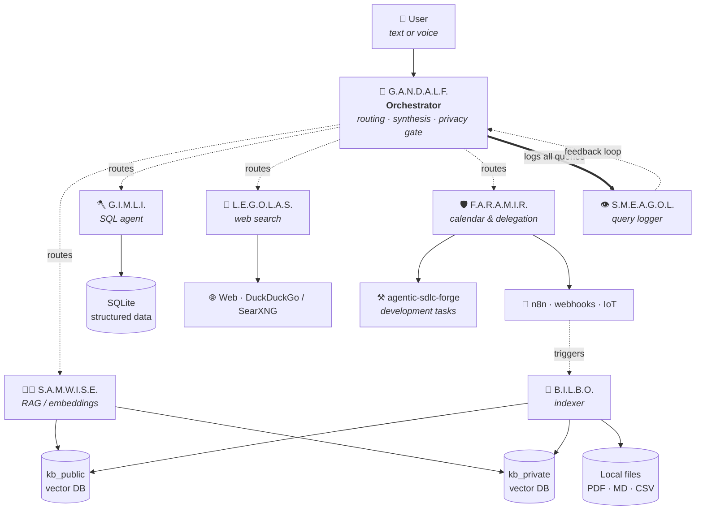

# 🧙 G.A.N.D.A.L.F.

**G**enerative **A**gent **N**avigating **D**atabases **A**nd **L**ocal **F**iles

> A local-first, multi-agent personal AI assistant running on Raspberry Pi 5.
> An attempt at building my own J.A.R.V.I.S. — minus the billionaire and the Iron Man suit.

---

## ⚠️ Project status

**This is a concept document.** Nothing is implemented yet. Every element described below — architecture, agents, knowledge base structure, technology choices — is subject to change as the project evolves. The README captures the *direction*, not the specification. Pieces will be built incrementally, and the design will adapt to what real usage reveals.

---

## 💡 Motivation

This project exists for four reasons, in roughly this order:

1. **Learn.** Modern multi-agent systems, RAG, agentic workflows, and on-device LLMs are reshaping how software is built. The best way to understand them is to build one from scratch.
2. **Build my own J.A.R.V.I.S.** The Tony Stark assistant fantasy is unattainable in full, but a stripped-down personal version — one that knows my projects, my data, and my context — is achievable today on consumer hardware.
3. **Own the stack.** Most useful AI tooling sends private data to third-party APIs. A local-first system keeps personal context (notes, finances, relationships, health) on hardware I control.
4. **Use the hardware I already have.** A Raspberry Pi 5 and a desktop with an RTX 2070 Super are sitting in my homelab. They're capable of running this — they just need the right software.

---

## 🏷️ A note on naming

All components in this system follow a `X.Y.Z.` acronym format, and yes — the names are Tolkien references. This is a deliberate convention, not an accident:

- The acronym always describes the component's **role** (e.g. `G.A.N.D.A.L.F.` = *Generative Agent Navigating Databases And Local Files*).
- The character chosen reflects the component's **disposition** — Samwise carries weight, Gimli digs through structured data, Legolas scouts the outside world.
- The metaphor fits the hardware: a small Raspberry Pi shouldering a large workload, a fellowship of specialised agents instead of one all-knowing model.

If a name feels forced, the role probably needs rethinking.

---

## 🏛️ Architecture

G.A.N.D.A.L.F. is built as a **router + specialised sub-agents** pattern. The main orchestrator does not try to know everything — it classifies incoming requests, delegates to the right sub-agent, and synthesises the final answer.

The user talks to Gandalf. Gandalf decides which agent (or combination) is needed, hands off the work, gathers the results, and produces the final answer. Every query — successful or not — flows through S.M.E.A.G.O.L. for logging.

---

## 🧝 The Fellowship — agents

Each agent has a single, well-defined responsibility. This is deliberate: small local models (Phi-3, Qwen2, Gemma) perform well on narrow tasks and poorly on generic "do everything" prompts.

### 🧑‍🌾 S.A.M.W.I.S.E.

**S**QL **A**nd **M**arkdown **W**ading **I**nto **S**emantic **E**mbeddings

The semantic search specialist. Handles unstructured data: notes, PDFs, transcripts, articles. Generates embeddings via a local model (e.g. `nomic-embed-text` through Ollama) and queries a vector database. Sam is the agent that knows *where to look* in private documents.

### 🪓 G.I.M.L.I.

**G**enerative **I**ntelligence **M**ining **L**ocal **I**nformation

The SQL agent. Digs through structured data: finance exports, dev-tracker logs, media metadata, homelab telemetry. Operates on SQLite databases with schema-aware prompts. When a question involves counting, summing, filtering, or comparing — Gimli takes over.

### 🏹 L.E.G.O.L.A.S.

**L**ocal **E**ngine **G**enerating **O**utputs, **L**ooking **A**t **S**earch

The scout. The only agent with outbound network access. Performs web searches for fact verification, current prices, exchange rates, news, and anything time-sensitive that can't live in the local knowledge base. Starts with DuckDuckGo, with a self-hosted SearXNG instance as the long-term target.

### 🎒 B.I.L.B.O.

**B**ot **I**ndexing **L**ocal **B**inary **O**bjects

The indexer. Not a reactive agent — runs in the background as a scheduled task. Walks watched directories, detects new or modified files, chunks them, and stores them in the knowledge base. Bilbo is what keeps the knowledge base alive without manual upkeep.

### 🛡️ F.A.R.A.M.I.R.

**F**orwarding **A**ctions, **R**eminders **A**nd **M**eetings, **I**nvoking **R**epositories

The executor and delegator. Manages calendars, reminders, and — most importantly — delegates real work to external systems. Faramir is the bridge between G.A.N.D.A.L.F. (knowledge orchestration) and tools like [`agentic-sdlc-forge`](https://github.com/Jarkendar/agentic-sdlc-forge) (development orchestration) or `n8n` workflows. When a request requires *doing something* rather than *knowing something*, Faramir handles the handoff.

### 👁️ S.M.E.A.G.O.L.

**S**torage **M**odule **E**valuating **A**ll **G**andalf's **O**perational **L**ogs

The query logger. Watches every interaction with the system, what got retrieved, what got routed where, how long it took, and whether the user was satisfied. Smeagol's data is what reveals which silos are missing, which agents are underused, and which queries consistently fail. The system improves by reading its own logs.

---

## 🧠 Knowledge base

The knowledge base is the hardest part of the project. Not because storing data is difficult — but because *organising personal context so that an AI can use it well* is an open problem. The design here is deliberately staged: start small, evolve as real usage reveals what's needed.

### Design principles

- **Privacy is tiered, not binary.** Some data should never leave the device under any circumstances. Other data can be sent to cloud models when needed. The split is enforced architecturally, not by convention.
- **Rate of change determines storage strategy.** Stable facts ("I live in Poland") and rapidly changing context ("what I read today") cannot share the same indexing logic.
- **Structure matters.** Bank exports belong in SQL, not in a vector database. Forcing everything into embeddings degrades both retrieval quality and answer correctness.
- **Evolutionary schema.** The initial structure will be wrong in unexpected ways. The system must be easy to refactor as real usage reveals what's missing.

### Phase 1 — Two zones

The MVP collapses the design into the simplest viable structure: two collections separated by privacy level.

| Zone | Examples | Allowed models |
|---|---|---|
| `kb_public` | Project notes, articles, courses, technical documentation, reference material | Local + cloud (Claude API, etc.) |
| `kb_private` | Personal facts, relationships, health, finances, journal entries | Local only — never sent to external APIs |

Within each zone, every chunk carries a `domain` metadata tag (`self`, `work`, `current`, `interests`, `finances`, `relationships`, `reference`, `future_ideas`, ...) so filtered retrieval is possible even with a flat structure.

### Phase 2 — Domain silos (when justified)

Once S.M.E.A.G.O.L.'s logs show which domains are actually queried, used, and useful, the public zone can be split into dedicated collections. Potential silos under consideration:

- **`kb_self`** — stable facts about me (rarely changes)
- **`kb_relations`** — relationships, social context (moderate change)
- **`kb_interests`** — topics I'm currently engaged with (frequent change)
- **`kb_knowledge`** — what I know, what I've learned, gaps (high change)
- **`kb_current`** — what I read, did, practised recently (very high change)
- **`kb_projects`** — projects and work (moderate change)
- **`kb_finances`** — financial state and history (mostly structured → SQL)
- **`kb_future`** — ideas, plans, things to explore (broad, fuzzy)
- **`kb_conversations`** — exports of meaningful AI conversations

This list is **a direction, not a specification**. Some silos may never materialise; others not on this list may emerge. The deciding factor is logged usage, not upfront design.

### Phase 3 — Hybrid structures (long-term)

Once domain silos stabilise, more sophisticated structures may be added selectively:
- **Knowledge graph** layer for explicitly curated areas (projects, learning paths)
- **Time-aware retrieval** with recency boosting for fast-changing silos
- **Hierarchical retrieval** (search summaries first, fetch full content on demand)

### Ingestion

How data actually gets *into* the knowledge base. Multiple modes, complementary rather than competing:

| Mode | Status | Description |
|---|---|---|
| **Watched folders** | MVP | B.I.L.B.O. monitors configured directories (notes, downloads, exports) and ingests changes automatically. |
| **Chat bot capture** | MVP | A Telegram/Signal bot acts as a quick-capture front-end — paste links, voice memos, files from anywhere. |
| **Drop zone webhook** | Future | HTTP endpoint exposed over Tailscale for `curl`, share-sheet uploads, or n8n workflows. |
| **Browser extension** | Future | One-click ingestion of articles, bookmarks, page snippets. |

---

## 🛣️ Potential paths

These are illustrative use cases — directions the system could be developed toward. Not all will be built, and others will likely emerge.

- **Personal finance brain** — analyse bank and brokerage exports through G.I.M.L.I., cross-reference with current rates via L.E.G.O.L.A.S.
- **Developer self-knowledge** — combine `dev-tracker` data, project notes, and commit history to answer questions about my own work patterns and progress.
- **Homelab sentinel** — monitor Docker, Ollama, n8n, and other services; answer "why is X slow today?" type questions.
- **Job hunt assistant** — index job offers, CVs, and interview notes; surface alignment between offers and skill profile.
- **Learning companion** — track progress through self-written courses and technical books, identify gaps, suggest next topics.
- **Calendar & task management** — F.A.R.A.M.I.R. as a natural-language layer over calendar, reminders, and recurring tasks.
- **Development delegation** — F.A.R.A.M.I.R. forwards implementation tasks to [`agentic-sdlc-forge`](https://github.com/Jarkendar/agentic-sdlc-forge), turning conversation into actual code changes.
- **Knowledge gap detection** — S.M.E.A.G.O.L. surfaces patterns of failed queries, suggesting which silos or sources are missing.

---

## 🛠️ Tech stack

All choices below are **tentative**. The stack will evolve as constraints become clearer through implementation.

| Layer | Likely choice | Why |
|---|---|---|
| Orchestration | LangGraph or LlamaIndex | Mature multi-agent routing, good Python ecosystem |
| Local LLM runtime | Ollama | Easy ARM support, model swapping, already in use |
| Models (RPi 5) | Phi-3, Qwen2 7B, Gemma 3 | Small, capable, decent tool-calling |
| Models (desktop fallback) | Larger Qwen / Llama via RTX 2070S | Heavy reasoning offloaded over Tailscale |
| Vector DB | ChromaDB | Lightweight, runs in-process, no separate service |
| Embeddings | `nomic-embed-text` via Ollama | Local, free, decent quality |
| Structured data | SQLite | Lightweight, file-based, native Python support |
| Background jobs | systemd timers | Already in use for `dev-tracker` |
| External triggers | n8n | Already running on the homelab |
| Networking | Tailscale | Already in use for remote access |
| Optional: voice | Whisper.cpp + Piper TTS | Lightweight enough for RPi 5 |

---

## 🗺️ Roadmap

The project is at **concept stage**. The intended build order:

1. **MVP** — single-script Gandalf with G.I.M.L.I. only, running on desktop against `dev-tracker` SQLite. Validates the router pattern before adding complexity.
2. **Add S.A.M.W.I.S.E.** — ChromaDB, embeddings, ingest a handful of existing PDFs and notes.
3. **Add S.M.E.A.G.O.L.** — query logging from day one, even if the dashboard comes later.
4. **Add B.I.L.B.O.** — automate ingestion via watched folders.
5. **Migrate to RPi 5** — observe what breaks, optimise model choice.
6. **Add L.E.G.O.L.A.S.** — web search for fact verification.
7. **Add F.A.R.A.M.I.R.** — calendar, reminders, delegation to `agentic-sdlc-forge`.
8. **Optional voice layer** — only if real usage proves it's wanted.

---

*"All we have to decide is what to do with the time that is given us."* — Gandalf
